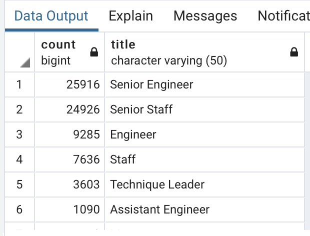
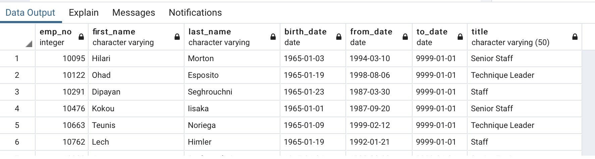

# Pewlett-Hackard-Analysis
Christopher Padilla Gregorio
09/07/2020

# Overview 
  The purpose of this analysis is to determine the number of retiring employer title and identify employees who are eligible to participate in a mentorship program. After determining the number of employees, a report is written to summarize the analysis and help the manager for the "silver tsunami" as many employees reach retirment age. In order to obtain the number of retiring employees, I used my knowleged in ERD to create the tables to coordinate the proper information is needed for the project. 

# Results 
  1. The number of Senior Engineers reaching retirement age is 25,916 
  2. The number of Managers reaching retirement age is only 2 
  3. The number of emloyees that are eligibile for the mentorship is 1,549 that were born in 1965
  4. Majority of eligibile employees have started at Pewlett Hackard between the late 80's and 90's
  
  
  
 
 
 # Summary 
  As Pewlett Hackard implement the "silver tsunami" program to employees that reach retirement age. There are certain roles that will be impact worse than others. The role of "Senior Engineer" will have the most turn over. However, there are enough senior engineers to mentor the next generation of employees at Pewlett Hackard. The manager position has the least number of retiring employees. This can cause for mentoring next generation mangers to be difficult. Overall, Pewlett Hackard has the capacity to train the next generation employees with the current number of employees in the program. 
